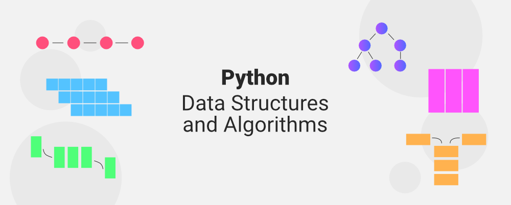

# Data Structure and Algorithm DOOR

Welcome to Data Structure and Algorithm DOOR, a repository documenting my learning journey in mastering Data Structures and Algorithms (DSA) using Python programming. This repo serves as a personal log and a resource for others embarking on a similar journey.

📌 Repository Overview

This repository includes:

1. Code Implementations: Solutions and explanations of common DSA problems.

2. Learning Notes: Key takeaways, concepts, and strategies.

3. Problem-Solving Approaches: Step-by-step breakdowns of solving DSA problems.

4. Challenges: My attempts and solutions from platforms like LeetCode, HackerRank, and others.

🚀 Purpose

To strengthen my understanding of DSA concepts.

To develop problem-solving skills for technical interviews.

To share my learning journey and help others in the same domain.

📂 Directory Structure

📦 Data-Structure-and-Algorithm-DOOR  
├── arrays/          # Array problems and solutions  
├── linked_lists/    # Linked list implementations  
├── stacks_queues/   # Stack and queue concepts  
├── trees_graphs/    # Tree and graph problems  
├── sorting_search/  # Sorting and searching algorithms  
├── dynamic_programming/ # Dynamic programming examples  
├── notes/           # Personal notes and study resources  
└── challenges/      # DSA challenges from various platforms

📖 Topics Covered

Arrays and Strings

Linked Lists

Stacks and Queues

Trees and Graphs

Recursion and Backtracking

Sorting and Searching Algorithms

Dynamic Programming

Bit Manipulation

🛠️ Tools & Technologies

Language: Python

Problem-Solving Platforms: LeetCode, HackerRank, GeeksforGeeks

🎯 Goals

1. Consistent problem-solving practice.

2. Explore advanced algorithms and data structures.

3. Learn optimal solutions for real-world problems.

🤝 Contributions

While this repository is primarily for personal learning, contributions and discussions are welcome! If you find an error or have suggestions, feel free to:

1. Open an issue to report bugs or suggest improvements.

2. Submit a pull request with your improvements.

📫 Connect

GitHub: Wasif Hossain
Feel free to star ⭐ the repo and follow my journey!

---

